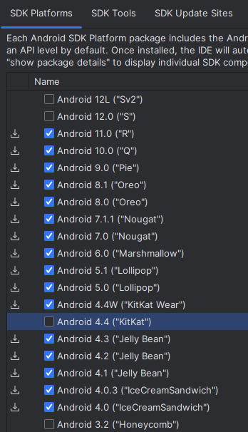
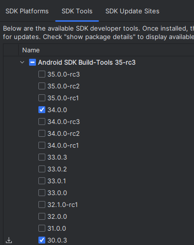
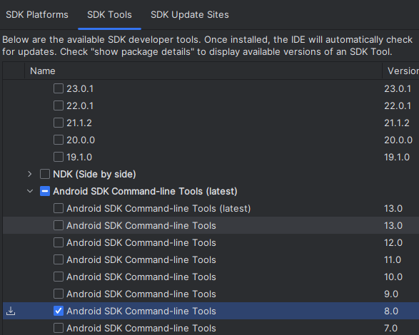
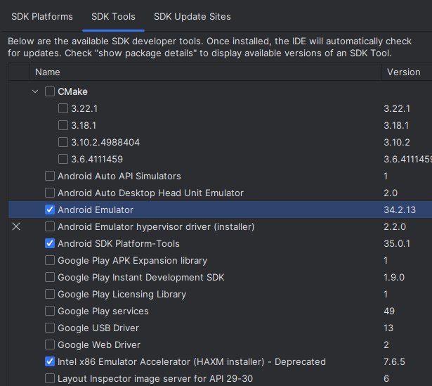

# Подготовка среды и запуск проекта

[TOCM]

## Установите WebStorm
## Установка Node + NVM

### Установите NVM https://github.com/nvm-sh/nvm.
### Установите Node.js 18:
```bash
nvm install 18
nvm use 18
```
### Установите Глобальные зависимости
```bash
npm install --global yarn
yarn global add @quasar/cli
npm install -g cordova
npm install -g @capacitor/android
```
## Установка Android Studio и настройка
Скачать последнюю версию AS https://developer.android.com/studio

В корне с необходимым диском создать папку Android со следующими дочерними директориями:
- Android Studio;
- SDK.

Установить Android Studio:
- указать папку установки для Android Studio: `Android/Android Studio`
- выбрать тип установки "Custom";
- указать папку установки для SDK: `Android/SDK`.

Запустить Android Studio, перейти в `Customize -> All settings`:
- перейти в Android SDK;
- установить SDK Platforms и SDK Tools как на скриншотах.








### Прописываем переменные среды
Путь к папкам нужно указать свой, куда была установлена среда и SDK Tools. После выполнения команд необходимо перезагрузить компьютер.
```shell
setx ANDROID_HOME "D:\Android\SDK" 
setx ANDROID_SDK_ROOT "D:\Android\SDK"
setx path "%path%;%ANDROID_SDK_ROOT%\tools;%ANDROID_SDK_ROOT%\platform-tools" 
```
### Подготовка SDK
В папке `Android/SDK/cmdline-tools` скопировать папку `8.0` и вставить её, поменяв название на `latest`.

В в PowerShell перейти в `C:\Android\SDK\cmdline-tools\latest\bin` **(указать свой путь)** и ввести:
```shell
.\sdkmanager --licenses
```
## Установка и настройка проекта
### WebStorm
1. Клонировать проект с Git.
2. Скачать зависимости. В терминале в папке `build` ввести:
```shell
yarn
npm install
yarn quasar mode add capacitor
ru.avanta.partner
```
3. Перейти в папку `src-capacitor` и ввести:
```shell
npx cap add android
```
4. В конфигурации добавить скрипты:
    - build
    - dev
    - dev:android
### Android Studio
Открыть папку `build/src-capacitor/android` проекта.


## Подпись приложения
### Генерируем ключ приложения
В Android Studio
```
"Build"->"Generate Signed App Bundle or APK"->"Android App Bundle"->"Creat new..."
```

Далее по инструкции  
В резльтате получаем ключ приложения .jks 
### Генерация сертификатов
Скачиваем pepk.jar
```shell
https://www.gstatic.com/play-apps-publisher-rapid/signing-tool/prod/pepk.jar
```
Полученый jar сохрянем в папку \Android Studio\plugins\android\lib 

Запускаем CMD и выполняем:  
* Важно! Меняем путь к jsr,jks и zip
* encryptionkey заменить на ключ который выдает платформа к примеру appGallery
```shell
java -jar "C:\Program Files\Android\Android Studio\plugins\android\lib\pepk.jar" --keystore "C:\Data\Jorgesys_Android\KEYSTORE\gruporeformakey.jks" --alias jorgeysioana --output="C:\Data\Jorgeys_Android\KEYSTORE\app_gallery_cert.zip" --encryptionkey=012300045E224EE22B45D19B23DB91BA9F52DE0A06513E03A5821409B34976FDEED6E0A47DBA48CC249DD93734A6C5D9A0F43461F9E140F278A5D2860846C2CF5D12345 --include-cert
```


полученный zip загружаем на вкладке подпись приложения в store
